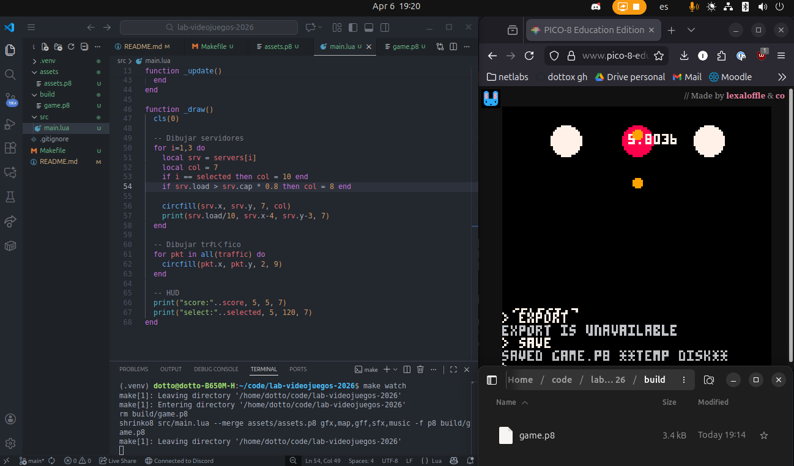

# lab-videojuegos-2026
Laboratorio de Videojuegos 2026

## Como desarrollar

Clona el repositorio y muevete a la root del proyecto.

1. **Usa `make setup` para instalar las dependecias.**
2. **Usa `make watch` para iniciar el hot-reload.** Cada vez que hagas un cambio en `src/` o `assets/` se va a crear la nueva build (`game.p8`)
3. **Organiza un setup parecido al de la imagen de abajo.** Puedes codear en un IDE, y desde el explorador mover el `game.p8` hacia Pico-8 Edu. Luego utiliza `RUN` en la terminal de Pico-8 para correr el juego.



---------------------

## Estructura de carpetas

**Esta es una estructura de ejemplo.** Los archivos dentro de src/ pueden variar.

```text
proyecto/
├── src/
│   ├── main.lua          # Punto de entrada (realiza los includes/imports)
│   ├── server.lua        # Lógica de servidores
│   ├── traffic.lua       # Lógica de tráfico
│   ├── input.lua         # Controles de usuario
│   ├── ui.lua            # Interfaz de usuario (HUD, menús)
│   └── utils.lua         # Funciones auxiliares y helpers
├── assets/
│   └── assets.p8         # Cartucho base con Sprites, Mapas y Sonidos
├── build/                # Binarios y cartuchos generados
│   └── game.p8           # Resultado final compilado
├── Makefile              # Automatización de build y watch
└── .gitignore            # Archivos ignorados (ej: .venv)
```

## Level Editor

Abre `scenes/editor/level_editor.tscn` en Godot y ejecútalo como escena. Desde ahí puedes cargar música, definir el playfield, crear zonas y proyectiles, y exportar/importar niveles en YAML. El YAML está pensado para este esquema simple (sin estructuras complejas, ni arrays con strings que contengan comas, ni strings multilínea).
